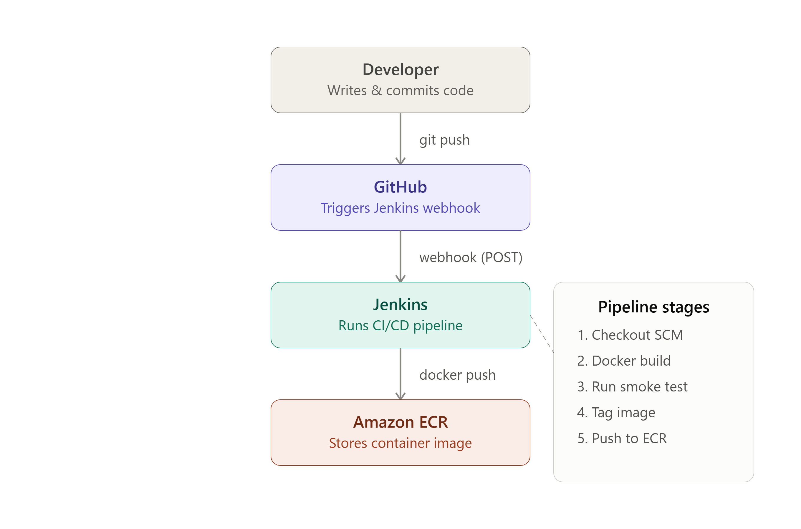
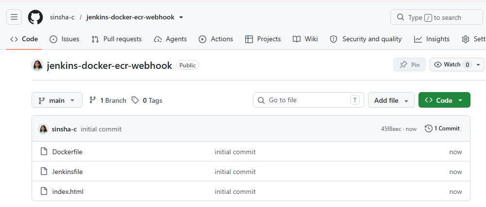
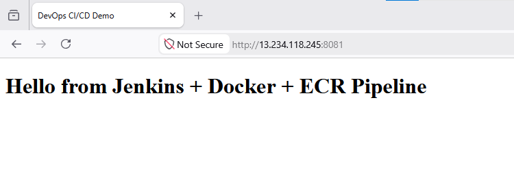
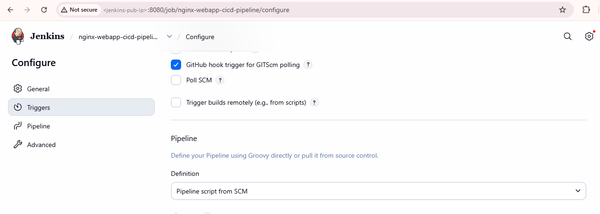
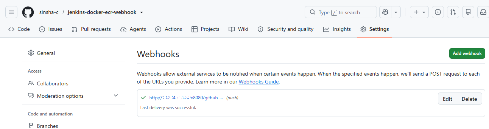
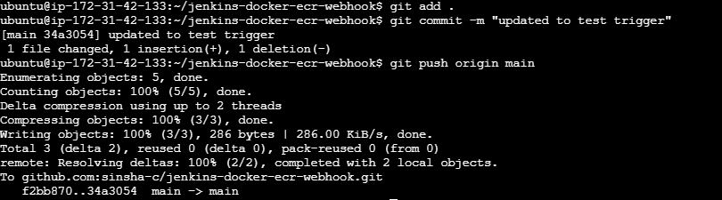
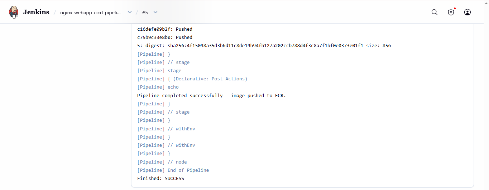
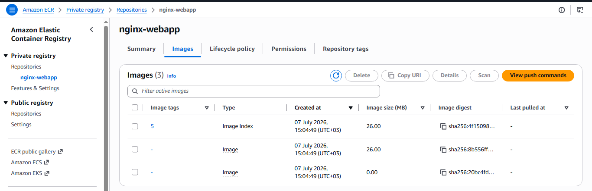
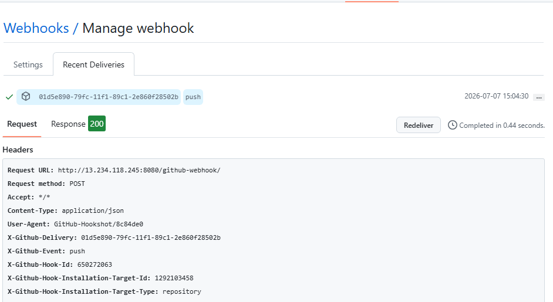

# Automated CI/CD Pipeline: GitHub → Jenkins → Docker → Amazon ECR


## Project Overview

This project automates the full build-and-release workflow for a company website. Instead of manually building and pushing Docker images every time developers commit code, a GitHub webhook triggers a Jenkins pipeline that builds the image, runs a smoke test to confirm the app starts correctly, and pushes the verified image to Amazon ECR — with zero manual Jenkins job execution.

**The problem this solves:** manual, error-prone, inconsistent deployments.
**The result:** a fully automated, repeatable, hands-off CI pipeline.

---

## Architecture

A simple architecture diagram or the Jenkins pipeline stage view showing the end-to-end flow.



---

## Tech Stack

| Category            | Tool                     |
|---------------------|--------------------------|
| Version Control      | GitHub                   |
| CI/CD Server         | Jenkins (Declarative Pipeline) |
| Containerization     | Docker                   |
| Web Server           | Nginx                    |
| Container Registry   | Amazon ECR (`ap-south-1`)|
| Trigger Mechanism    | GitHub Webhook           |

---

## Repository Structure

```
jenkins-docker-ecr-webhook/
├── Dockerfile
├── index.html
├── Jenkinsfile
├── screenshots
└── README.md
```

---

## Part 1 – GitHub Repository Setup

- Created a public GitHub repository to host the source code and pipeline definition.
- Uploaded the three core files: `Dockerfile`, `index.html`, and `Jenkinsfile`.
- Confirmed the repository is publicly accessible and clones correctly.

```bash
git clone https://github.com/<your-username>/jenkins-docker-ecr-webhook.git
```

> GitHub repository page showing the three uploaded files.
> 

---

## Part 2 – Docker Application (Nginx Web App)

A minimal static website served through Nginx.

**index.html**
```html
<!DOCTYPE html>
<html>
<head>
    <title>DevOps CI/CD Demo</title>
</head>
<body>
    <h1>Hello from Jenkins + Docker + ECR Pipeline 🚀</h1>
</body>
</html>
```

**Dockerfile**
```dockerfile
FROM nginx:alpine
COPY index.html /usr/share/nginx/html/index.html
EXPOSE 80
```

Built and tested locally before wiring it into the pipeline:
```bash
docker build -t nginx-webapp .
docker run -d -p 8081:80 nginx-webapp
curl http://localhost:8081
```

> Browser view of the running Nginx page.
> 

---

## Part 3 – Jenkins Declarative Pipeline
### Prerequisite: Create the ECR Repository
 
Pushing an image does **not** auto-create the repository — do this once, before the first pipeline run, or the push stage fails with `repository ... does not exist`:
```bash
aws ecr create-repository --repository-name nginx-webapp --region ap-south-1
```
Or via console: **ECR → Repositories → Create repository** → name `nginx-webapp` → Create.
 
The `Jenkinsfile` defines four stages: checkout, build, smoke test, and push to ECR.

```groovy
pipeline {
    agent any

    environment {
        AWS_REGION     = 'ap-south-1'
        ECR_LOGIN       = '<aws-account-id>.dkr.ecr.ap-south-1.amazonaws.com'
        ECR_REPO       = '<aws-account-id>.dkr.ecr.ap-south-1.amazonaws.com/nginx-webapp'
        IMAGE_TAG      = "${BUILD_NUMBER}"
    }

    stages {
        stage('Checkout') {
            steps {
                checkout scm
            }
        }

        stage('Build Docker Image') {
            steps {
                sh "docker build -t nginx-webapp:${IMAGE_TAG} ."
            }
        }

        stage('Smoke Test') {
            steps {
                sh """
                    docker run -d --name smoke-test -p 8081:80 nginx-webapp:${IMAGE_TAG}
                    sleep 5
                    curl -f http://localhost:8081 || exit 1
                    docker stop smoke-test && docker rm smoke-test
                """
            }
        }

        stage('Push to Amazon ECR') {
            steps {
                sh """
                    aws ecr get-login-password --region ${AWS_REGION} | docker login --username AWS --password-stdin ${ECR_LOGIN}
                    docker tag nginx-webapp:${IMAGE_TAG} ${ECR_REPO}:${IMAGE_TAG}
                    docker push ${ECR_REPO}:${IMAGE_TAG}
                """
            }
        }
    }

    post {
        success {
            echo 'Pipeline completed successfully — image pushed to ECR.'
        }
        failure {
            echo 'Pipeline failed. Check the smoke test or ECR credentials.'
        }
    }
}
```

**Jenkins setup steps:**
1. Installed the Docker Pipeline and Amazon ECR plugins.
2. Configured AWS credentials in Jenkins (IAM user with ECR push permissions).
3. Created a new Pipeline job — suggested name: nginx-webapp-cicd-pipeline — pointing to the GitHub repository, using the Jenkinsfile from SCM.

> Jenkins pipeline configuration page (Pipeline script from SCM).
> 

> Jenkins job "Build Triggers" section with the GitHub hook option checked.
> 

### AWS Authentication — IAM Role Attached to EC2 (Recommended)
 
1. IAM → Roles → Create role → Trusted entity: AWS service → Use case: EC2
2. Attach policy: `AmazonEC2ContainerRegistryPowerUser`
3. Name it (e.g. `jenkins-ecr-role`) → Create role
4. EC2 → Instances → select Jenkins instance → Actions → Security → Modify IAM role → choose `jenkins-ecr-role` → Update

---

## Part 4 – GitHub Webhook Configuration

1. In the GitHub repo: **Settings → Webhooks → Add webhook**.
2. Payload URL: `http://<jenkins-server-ip>:8080/github-webhook/`
3. Content type: `application/json`
4. Trigger: **Just the push event**.
5. In the Jenkins job: enabled **GitHub hook trigger for GITScm polling** under Build Triggers.

> GitHub webhook configuration screen with a green checkmark (successful delivery).
> 

---

## Part 5 – Verification

1. Making a change in index.html
2. Push the changes to github repo

> git push to test the trigger
> 

---

> Successful pipeline run from jenkins.
> 

---

> Amazon ECR repository showing the pushed image tag(s).
> 

---

> GitHub "Recent Deliveries" tab under webhook settings, showing a `200` response.
> 

---

| Check                                   | Result |
|------------------------------------------|--------|
| Jenkins starts automatically on push      | ✅ Verified |
| Docker image builds successfully          | ✅ Verified |
| Smoke test passes (container responds)    | ✅ Verified |
| Image appears in Amazon ECR               | ✅ Verified |
| No manual Jenkins job execution required  | ✅ Verified |

---

## Troubleshooting Notes

- **Webhook not triggering the build:** confirm the Jenkins URL is reachable from the internet (or GitHub, if self-hosted) and that the payload URL ends in `/github-webhook/`.
- **Smoke test failing intermittently:** increase the `sleep` duration to give Nginx more time to start before the `curl` check.
- **ECR login errors:** verify the Jenkins IAM role/credentials have `ecr:GetAuthorizationToken`, `ecr:BatchCheckLayerAvailability`, `ecr:PutImage`, and related push permissions.

---

## Key Learnings

- Designing a Declarative Jenkins Pipeline with clearly separated build, test, and deploy stages.
- Using a smoke test as a lightweight quality gate before pushing an image.
- Wiring GitHub webhooks to Jenkins for a fully event-driven CI/CD flow.
- Managing AWS ECR authentication securely from within a Jenkins pipeline.

---

## Author

**Sinsha C**

[](https://github.com/sinsha-c)
[](https://linkedin.com/in/sinshac)

---
